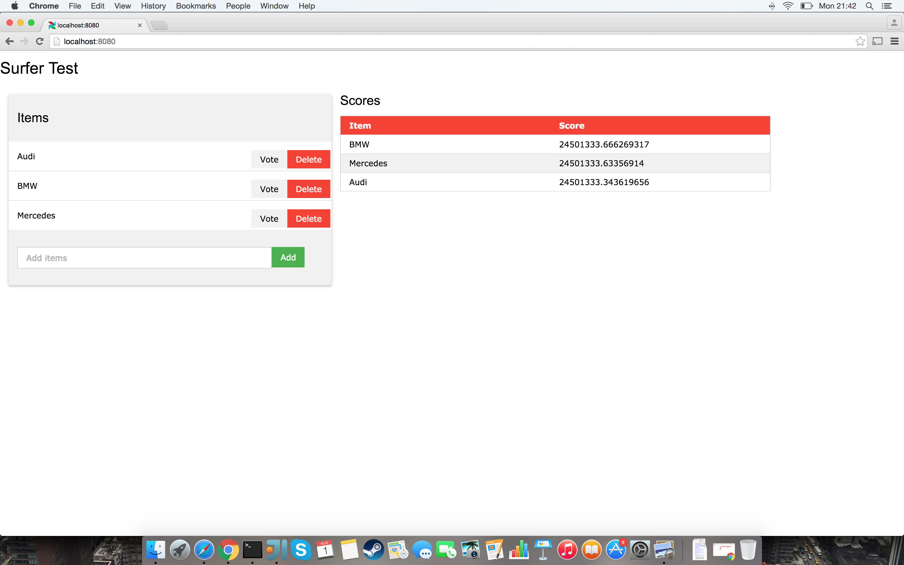

# Surfer
Surfer is a scalable implementation of the idea presented [here] [hotItems] for determining popular items. 
It is built on top of Spark Streaming and written in Scala.

### Running locally

Build the project

```sh
$ sbt clean package
```
Run the test webapp

```sh
$ cd test-webapp/
$ python3 webapp.py
```
This will wait for the Spark application to start and connect. So go ahead and run it.
```sh
$ $SPARK_HOME/spark-submit target/scala-2.11/surfer_2.11-0.0.1.jar
```
Now you can visit the webpage by typing http://localhost:8080/ in your browser.

On the page you can add new item names and vote for them and see how the scores are updates (with a slight delay).


License
----
MIT

   [hotItems]: <http://julesjacobs.github.io/2015/05/06/exponentially-decaying-likes.html>